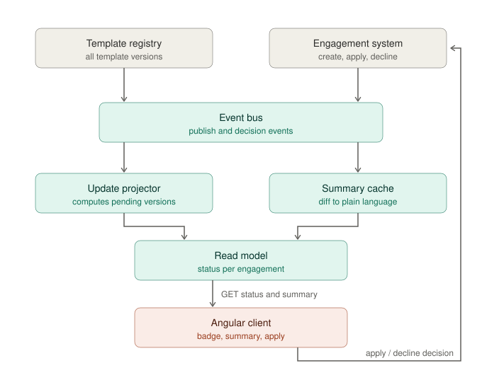
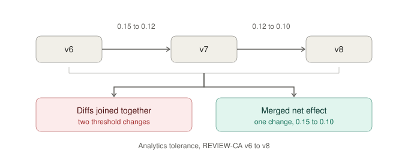

# Design

The goal: for each engagement file, show if it is behind its product template, and show what will
change if the user applies the update. For hundreds of engagements per firm.

The API contract is in `api/contract.ts` and does not count toward the length of this document.

## 1. High-Level Architecture

Loading an engagement file takes about one minute. So nothing on the read path is allowed to open
one. Everything the list screen needs comes from a projection built from events.

**Update projector.** Keeps one row per engagement: template id, current version, last checked.
These rows are written only from engagement events, never by opening a file. When a firm starts, we
do one slow scan to fill the table. After that it stays up to date from events.

When a new template version is published, the projector looks at its own rows for that template and
marks the ones that are behind. Updates happen about once a week per product, so this is rare and
cheap.

**Summary cache.** The key is `(templateId, fromVersion, toVersion)`, not the engagement. This is the
most important decision in the design. The summary for AUDIT-CA v3 → v5 is the same for every
engagement in every firm that sits on that pair. In the sample data, 12 engagements need only 6
summaries. At real scale the difference is much bigger.

When a version is published, we generate summaries for the pairs that are actually in use (we can
ask the projection which ones those are). Anything else is generated on first request.

**Accumulated updates.** If an engagement is two versions behind, the user gets one decision for the
whole gap, not one per release. The registry can compare two versions directly, and that direct diff
is the truth of what will be applied. `DiffCoalescer` merges the step-by-step diffs into the same
result, which lets us also show a per-release breakdown without counting a change twice. The test
`DiffCoalescerTest` proves the two agree, using the supplied fixtures.

**Server and client split.** The server does the version ordering, the merging, the classification
and the text. The client only chooses what to show, sends the user's decision, and renders the
states from the contract. The client never sees a raw diff.

### Client / Server Contract

Full types are in `api/contract.ts`. The Java records mirror them.

`GET /v1/firms/{firmId}/engagements/update-status` returns a page of engagements. Each one is
`UP_TO_DATE`, `UPDATE_AVAILABLE`, or `UNKNOWN`.

`UNKNOWN` exists on purpose. If the projection cannot answer, we must not show a green "up to date"
badge. Telling a practitioner their file is current when we do not know is the worst mistake this
screen can make.

Freshness appears in two places. The page has `generatedAt` and `projectionLagSeconds`, so the UI can
warn that the list itself is behind. Each pending update has a summary envelope with status
`READY`, `COMPUTING`, `FAILED` or `STALE`, plus `computedAt` and `generatorVersion`. So "the text is
not ready yet" is a real state the UI must handle, not a missing field it could read as "no changes".

Because the pending state comes from the projection and not from the summary, the badge and the
Apply button still work even when the text is missing.

`POST /v1/engagements/{id}/template-update/decision` sends back the `fromVersion` and `toVersion` the
user actually looked at. If a new version was published while they were reading, the server answers
`409 VERSION_MOVED` instead of applying more than what was shown. The response is `202 Accepted` with
an idempotency key, because applying is slow and happens later.

### Human-Readable Change Summary

This happens on the server, when the summary is generated, and the result is cached per version pair.

Three reasons, most important first:

1. **Section names are only in the template.** The diff says `/sections/inquiries/...`. Only the
   template content says that section is called "Inquiries". The client would need to fetch the
   template to know this, which is not its job.
2. **The result is shared.** Every firm on the same version pair gets the same text. Doing this in
   the client throws the cache away.
3. **It must be repeatable.** We save `generatorVersion` with every summary, so if a practitioner
   relied on this text inside an audit file, we can explain it months later.

There are two layers. `ChangeSummaryComposer` classifies each change by rules: new content, removed
content, threshold change, wording change, or metadata. It uses the author's own `label` when the
change has one, and writes thresholds the way a practitioner reads them: "Tightened from 4.5% to 4%".

An optional language model sits behind `SummaryNarrator`. It may only rewrite the list it is given in
nicer words. It does not decide what changed, does not reclassify, and does not add or remove items.
The output is checked against the list before caching, and if the check fails we use the plain
headline instead.

## 2. Implementation Plan

Each step should be useful on its own.

1. **Projection and events.** Event handlers, the read model, and the first scan. After this the list
   screen already works with counts and version numbers, which is the main thing users asked for.
2. **Summaries with rules only.** The coalescer, the composer, the cache, and generating summaries
   when a version is published. Real readable text, no model involved.
3. **The decision endpoint.** Idempotency, version check, `409` handling. Apply first, Decline after.
4. **The language model layer, behind a flag.** Only after the rule-based text has been reviewed and
   the validation is in place.

## 3. Testing Strategy

- **Merging matches the direct diff** (done). Merging REVIEW-CA v6→v7 and v7→v8 must give exactly the
  collapsed v6→v8 diff from the fixtures. This is what stops the user from seeing a tolerance of
  0.12, a value their file never had.
- **Version ordering** (done). Versions start at 3, 6 and 10, so the order must come from the
  catalog, not from subtracting numbers.
- **No cost when up to date** (done). An engagement on the latest version never asks for a summary.
- **Same input, same output.** The same diff must always produce the same summary. Caching is only
  safe if this is true.
- **Repeated and out-of-order events.** The projection must end in the same state either way.
- **All contract states.** The client shows `COMPUTING`, `FAILED` and `UNKNOWN` differently. The
  fixture includes all of them, so this is tested without a backend.
- **Model output validation.** If the generated text adds, drops or changes an item, reject it.

## 4. Evaluation & Observability

**Is it correct?** The projection is a copy of data whose real source is slow to read. So it needs a
regular check: every night, load a small sample of real engagement files and compare their template
version with the projection. How often they disagree is the number that matters most. Everything else
is an indirect signal.

**Is it fresh?** Track the projection lag, and the time from publishing a version to the summary
being ready (p50 and p95). The number that matters to the user is: when someone opens a pending
update, how often is the summary already there?

**Is the cache working?** Divide distinct version pairs by engagements that are behind. In the sample
data that is 6/6. At real scale it should be much lower. If it moves back toward 1:1, the main
assumption of this design is wrong and we should generate on demand instead.

**Is the text good?** Every summary is saved with its generator version, and the model id if one was
used, so any text a user saw can be reproduced. Content teams review a sample after each release.
Another useful signal: how often users open the raw change detail. If that is high, the summary is
not doing its job.

**Alerts.** Failed summary rate, projection lag above a limit, and the rate of `409 VERSION_MOVED`.
The last one is also a product signal: if it is high, users review slower than content is published.

## 5. Failure Modes & Tradeoffs

**A lost event.** The projection keeps an old version and the user sees the wrong state. The nightly
check above finds this. We also check the version again when the user submits a decision, which is
the moment where being wrong actually costs something.

**Summary generation fails.** The pending state is still correct, because it comes from the
projection. The badge and the buttons keep working; only the text is missing. This separation is
intentional.

**A new version arrives while the user is reading.** Without the check, they would apply more than
they saw. The `409` costs them a second review. In an audit product, correct is better than
convenient.

**Merging hides the steps in between.** This is the main tradeoff. The merged result is what the file
will actually receive, so it is what the decision should be based on. For anyone who needs the
detail, `pendingVersions` keeps the per-release list.

**The list can be behind.** We show `projectionLagSeconds` instead of hiding it. A visibly old answer
is safer than an invisibly old one.

### Assumptions

- Version numbers are identifiers with an order from the catalog, not counters.
- Diff paths point to map keys, not array positions. The AUDIT-CA v5 fragment confirms this:
  `questions` is an object with keys `"3"` and `"7"`.
- No previous apply or decline history. Each engagement's saved version is its starting point.
- Applying the content is out of scope. `202` means the decision was saved.
- The AUDIT-CA v5 fragment does not include the `items` list that the v4→v5 diff adds. I treated it
  as a short example, not as a contradiction.
